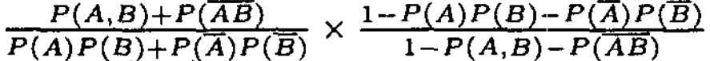

#	Problem Section 01
##	1.1 Apriori
###	Libraries/References Explored
*	[Selecting the right interestingness measure for association patterns](./Interestingness_Measures_in_Patterns.pdf)
*	[ML xtend](http://rasbt.github.io/mlxtend/)
*	[Efficient Apriori](https://github.com/tommyod/Efficient-Apriori)
*	[Apyori](https://github.com/ymoch/apyori)
*	Project to follow : [Association_Rule_Learning_Python](https://github.com/StephanieStallworth/Association_Rule_Learning_Python)
###	Definitions
*	Support
	>	The support of a rule is the frequency of which the LHS and RHS appear together in the dataset. If X -> Y is a rule, then the support is P(Y and X).
*	Confidence
	>	The confidence of a rule is the probability of the RHS given the LHS. If X -> Y, then the confidence is P(Y|X).
*	Lift
	>	The lift of a rule is the ratio of the observed support to the expected support if the LHS and RHS were independent.If X -> Y, then the lift is given by the fraction P(X and Y) / (P(X) * P(Y)). Lift may find very strong associations for less frequent items
*	Conviction
	>	The conviction of a rule X -> Y is the ratio P(not Y) / P(not Y | X). It's the proportion of how often Y does not appear in the data to how often Y does not appear in the data, given X. If the ratio is large, then the confidence is large and Y appears often.
*	Leverage
	>	Leverage of a rule X -> Y is the difference of the support of the rule and the expected support if the LHS and RHS were independent i.e. P(X -> Y)-(P(X) * Pgit (Y)).
*	Collective Strength
	>	Given rule A -> B  
	>	Collective Strength = 
*	Added Value
	>	Given rule A -> B  
	>	Added Value = max (P(B|A) - P(B), P(A|B) - P(A))
-- --

##	1.2 Bayesian Classifier
###	Libraries/References Explored
*	[The Best Metric to Measure Accuracy of Classification Models](https://www.kdnuggets.com/2016/12/best-metric-measure-accuracy-classification-models.html/)
*	[The Basics of Classifier Evaluation: Part 1](https://www.svds.com/the-basics-of-classifier-evaluation-part-1/)
*	[Classification: ROC Curve and AUC](https://developers.google.com/machine-learning/crash-course/classification/roc-and-auc)
###	Definitions
Confusion Matrix | Observed True | Observed False
----|---------------|---------------
Actual True | True Positive (TP) | False Negative (FN)
Actual False | False Positive (FP) | True Negative (TN)

*	Recall
	>	Sensitivity also known as the True Positive rate or Hit Rate or Recall is calculated as,  
	>	**Sensitivity = TP / (TP + FN)**  
	>	Since the formula doesn’t contain FP and TN, Sensitivity may give you a biased result, especially for imbalanced classes
*	Precision
	>	Precision also known as Positive Predictive Value is calculated as,  
	>	**Precision = TP / (TP + FP)**  
	>	Since the formula does not contain FN and TN, Precision may give you a biased result, especially for imbalanced classes.
*	F1 Score (Harmonic Mean of Recall and Precision)
	>	F1 score incorporates both Recall and Precision and is calculated as:  
	>	**F1 score = 2 * (Precision * Recall) / (Precision + Recall)**  
	>	The F1 score represents a more balanced view compared to the above 3 metrics but could give a biased result in some scenarios since it doesn’t include TN.
*	Specificity
	>	Specificity, also known as True Negative Rate is calculated as,  
	>	**Specificity = TN / (TN + FP)**  
	>	Since the formula does not contain FN and TP, Specificity may give you a biased result, especially for imbalanced classes.
*	AUC (Area Under Curve)
	>	An ROC curve plots TPR (True Positive Rate) vs. FPR (False Positive Rate) at different classification thresholds. Lowering the classification threshold classifies more items as positive, thus increasing both False Positives and True Positives.  
	>	AUC stands for "Area under the ROC Curve." That is, AUC measures the entire two-dimensional area underneath the entire ROC curve (think integral calculus) from (0,0) to (1,1).
*	Mathew's Correlation Coefficient
	>	Unlike the other metrics discussed above, MCC takes all the cells of the Confusion Matrix into consideration in its formula.  
	>	**MCC = {(TP * TN) – (FP * FN)} / sqrt{(TP +FP) * (TP + FN) * (TN + FP) * (TN + FN)}**  
	>	Similar to Correlation Coefficient, the range of values of MCC lie between -1 to +1. A model with a score of +1 is a perfect model and -1 is a poor model. This property is one of the key usefulness of MCC as it leads to easy interpretability.
-- --

##	1.3 K-Means Clustering
###	Libraries/References Explored
*	[Clustering performance evaluation](https://scikit-learn.org/stable/modules/clustering.html#clustering-evaluation)
*	[Cluster_analysis](https://en.wikipedia.org/wiki/Cluster_analysis#Internal_evaluation)
###	Definitions
*	Radius
	>	The radius of a cluster is the maximum distance between all the points and the centroid. Preference is to combine the two clusters whose resulting cluster has the lowest radius.
*	Density
	>	Density of a cluster is the average number of points present per unit area such that the differentiation can be made between sparse region and a dense cluster.  
	>	In density-based clustering, clusters are defined as areas of higher density than the remainder of the data set. Objects in these sparse areas - that are required to separate clusters - are usually considered to be noise and border points.
*	Silhouette coefficient
	>	The silhouette coefficient contrasts the average distance to elements in the same cluster with the average distance to elements in other clusters. Objects with a high silhouette value are considered well clustered, objects with a low value may be outliers. This index works well with k-means clustering, and is also used to determine the optimal number of clusters.
-- --

#	Problem Section 02
##	Frequent Itemset Mining
###	Libraries/References Explored
*	SciKit Learn
	-	No Support for FIM
*	[mlxtend](https://pypi.org/project/mlxtend/)
*	[orange](https://docs.biolab.si/2/)
	-	[orange associate](https://orange3-associate.readthedocs.io/en/latest/scripting.html)
*	[fim](https://pypi.org/project/fim/)
*	[pymining](https://pypi.org/project/pymining/)
*	[Efficient Apriori](https://github.com/tommyod/Efficient-Apriori)
*	[Apyori](https://github.com/ymoch/apyori)
-- --

